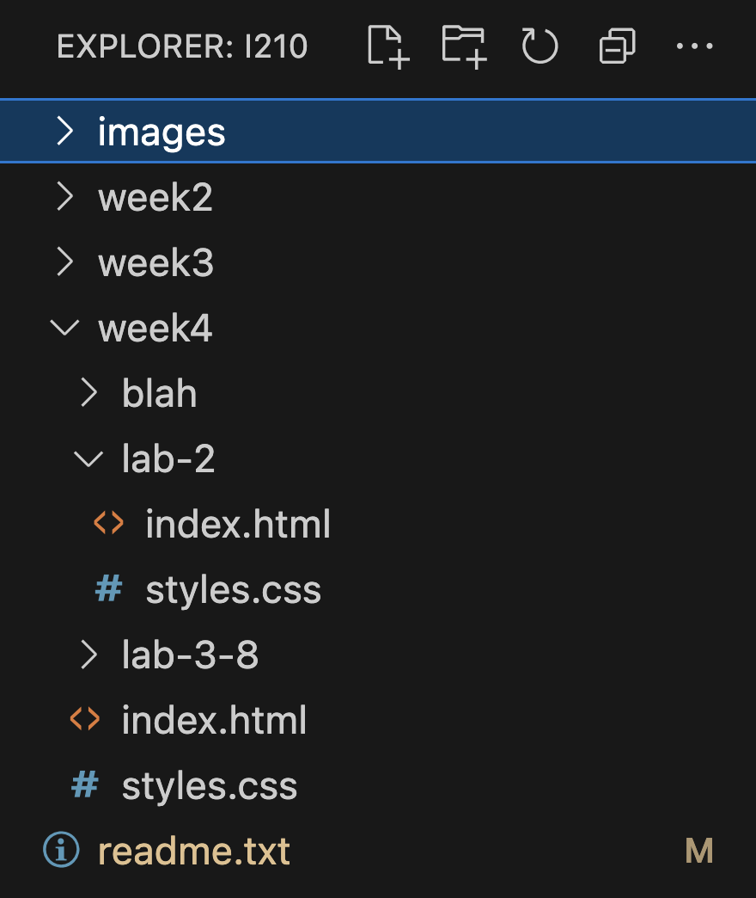

Name: Ty Streets
Date: 9/3/24
Description:
This is the base folder for all of my i210 websites. Each website will be in a sub-folder.

Base URL:
https://tstreets.github.io/i210/

Week 4 In Class Site
https://tstreets.github.io/i210/week4/index.html

Week 4 Lab 2
https://tstreets.github.io/i210/week4/lab-2

Random File:
https://tstreets.github.io/i210/week4/blah/other.html

Steps to add another Link on readme

1. Enter the name of the link on readme

2. On readme, copy base URL then paste below project name. It should look like this:
   https://tstreets.github.io/i210/

3. Navigate to main file in vs code for that project
   

4. Right click then select copy relative path
   

5. Paste relative path after base url for that project name like:
   https://tstreets.github.io/i210/week4/lab-2/index.html
